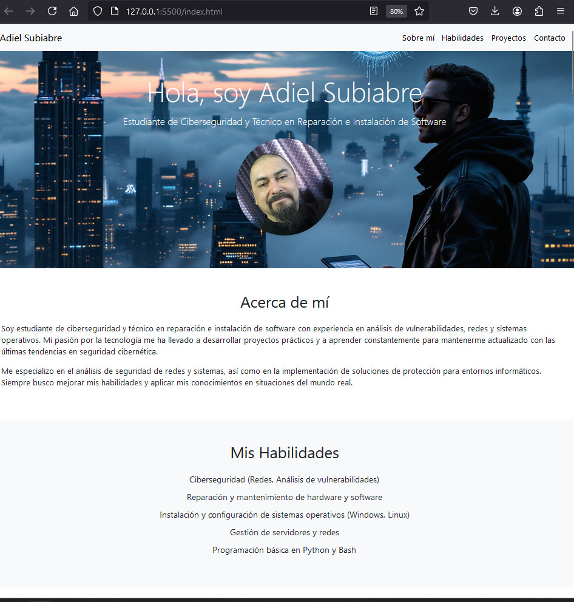

# Examen Final: Conceptos Técnicos - Adiel Subiabre

Este repositorio contiene el examen final para la asignatura **Conceptos Técnicos** del **CFT Los Lagos**, donde se han cumplido una serie de actividades que abarcan cuestionarios, medallas en GitHub, creación de perfil profesional en LinkedIn, módulos de Microsoft Learn, y la creación de un portafolio web adaptado a dispositivos móviles.

## Tabla de Contenidos

1. [Cuestionarios Formativos y Sumativos](#cuestionarios-formativos-y-sumativos)
2. [Medallas en GitHub](#medallas-en-github)
3. [Perfil Profesional en LinkedIn](#perfil-profesional-en-linkedin)
4. [Módulos de Microsoft Learn sobre Git](#modulos-de-microsoft-learn-sobre-git)
5. [Plantilla de Portafolio y Personalización](#plantilla-de-portafolio-y-personalización)
6. [Repositorio en GitHub](#repositorio-en-github)
7. [Capturas de Pantalla](#capturas-de-pantalla)

## Cuestionarios Formativos y Sumativos

He realizado todos los **cuestionarios formativos y sumativos** disponibles en la plataforma **Quinttos** relacionados con la asignatura.

### Cuestionario 1

### Cuestionario 2

### Cuestionario 3

### Cuestionario 4

### Cuestionario 5

### Cuestionario 6

## Medallas en GitHub

He obtenido al menos **4 medallas** en mi perfil de GitHub a través de actividades en repositorios, contribuciones, proyectos y otras dinámicas.

### Captura de Pantalla del Perfil de GitHub

## Perfil Profesional en LinkedIn

He creado y completado un perfil profesional en **LinkedIn** con los siguientes puntos:

- Foto de perfil presentable.
- Imagen de cabecera adecuada.
- Publicación de experiencia laboral, proyectos y estudios.
- Subida de al menos **3 diplomas, títulos o certificados**.
- Agregado que estoy estudiando en el **CFT Los Lagos**.
- Seguimiento de la página del **CFT Los Lagos**.
- Envío de solicitud al docente.
- Publicación de al menos **3 publicaciones** sobre avances, trabajos o aprendizajes.
- Enlace a mi perfil de **GitHub**.

### Captura de Pantalla de mi Perfil de LinkedIn

## Módulos de Microsoft Learn sobre Git

He completado los siguientes **4 módulos de Microsoft Learn** sobre Git:

1. **Introducción a GitHub Copilot**
2. **Introducción a GitHub**
3. **Introducción a Git**
4. **Uso de GitHub Copilot con Python**

### Captura de Pantalla de los Módulos Completados

## Plantilla de Portafolio y Personalización

He descargado y adaptado un **template de portafolio** desde [ThemeWagon](https://themewagon.com/theme-tag/portfolio-template/). He personalizado completamente el portafolio con mis datos, habilidades y certificaciones, para que no se vea como un template estándar.

El portafolio incluye:

- Enlaces importantes, como mi perfil de **LinkedIn** y **GitHub**.
- Un **formulario de contacto** configurado con **FormSubmit** para recibir correos directamente en mi email.
- El diseño es **funcional y responsive**, adaptado a dispositivos móviles.

### Captura de Pantalla del Portafolio

## Repositorio en GitHub

Este repositorio contiene todo el material relacionado con el examen final, incluyendo:

- El **portafolio web** alojado en el repositorio.
- **Capturas de pantalla** de los cuestionarios, perfil de LinkedIn, medallas de GitHub, módulos de Microsoft Learn y el portafolio.
- Un archivo `README.md` explicativo con todos los detalles de las evidencias.

Licencia

Este proyecto está bajo la Licencia MIT. Para más detalles, revisa el archivo LICENSE.
Contacto

    Correo Electrónico: adiel.subiabre@gmail.com
    LinkedIn: Adiel Subiabre
    GitHub: XfoonkeeMoonkeeX
